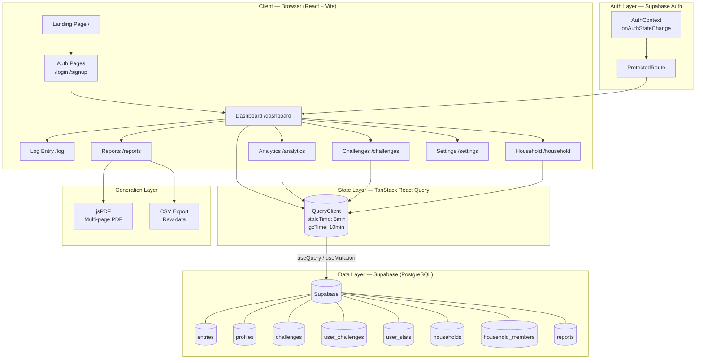
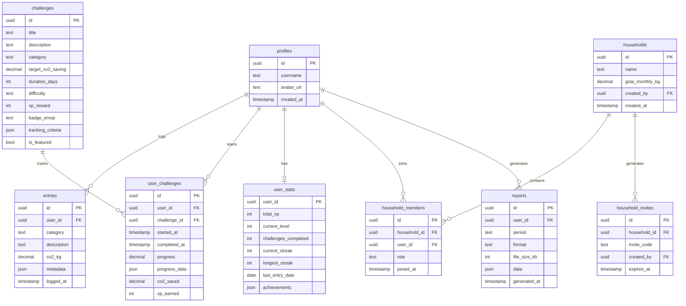
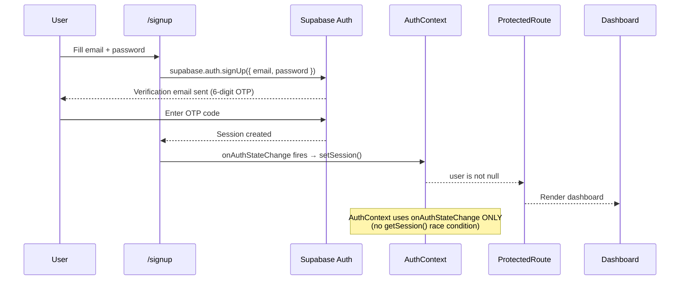
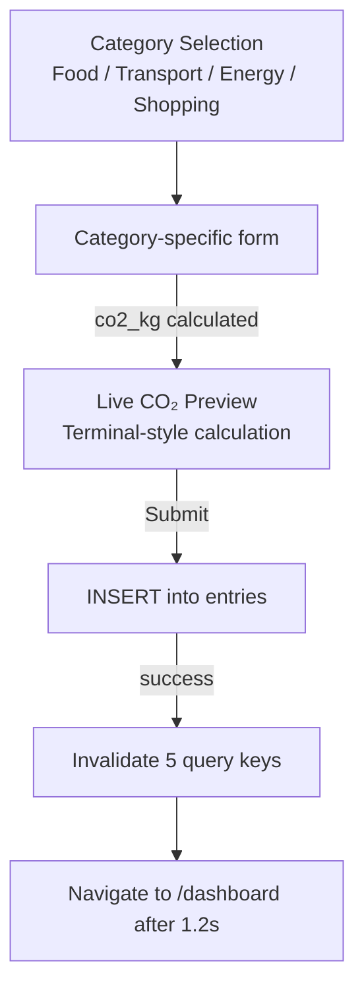
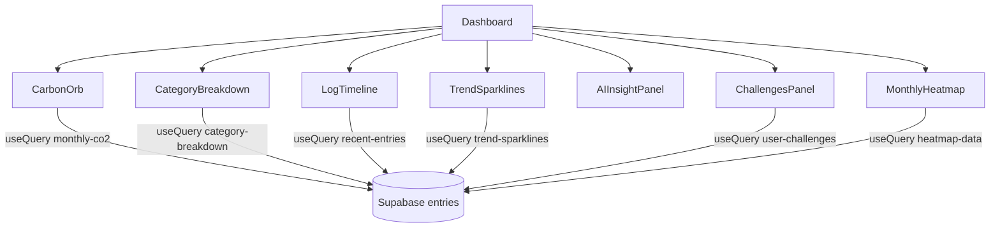
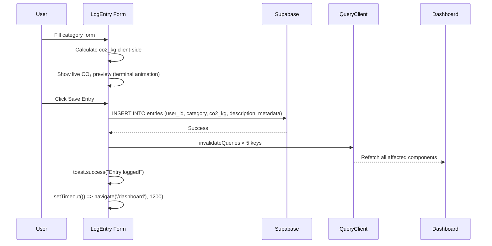
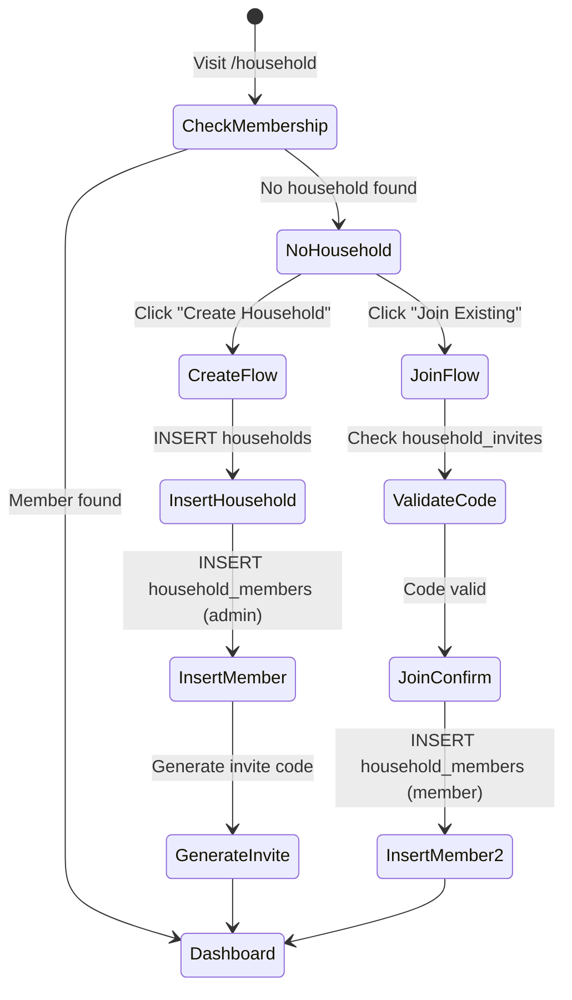
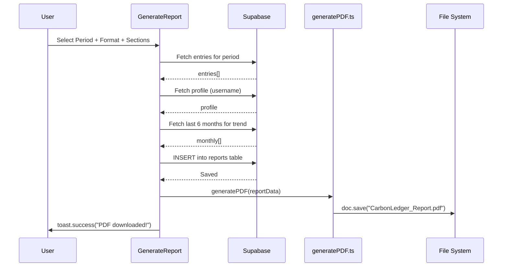

# CarbonLedger — Climate Operations Center

> **"Your planet. Your numbers. Your move."**

CarbonLedger is a full-stack personal carbon intelligence platform built on React + Vite + Supabase. It transforms raw lifestyle choices into real-time emission data, surfaces AI-generated insights, drives behavior change through a gamified challenge system, and enables households to track and reduce their collective carbon footprint — all wrapped in a NASA mission-control aesthetic.

---

## Table of Contents

1. [Project Overview](#1-project-overview)
2. [Tech Stack](#2-tech-stack)
3. [Directory Structure](#3-directory-structure)
4. [Architecture Overview](#4-architecture-overview)
5. [Database Schema](#5-database-schema)
6. [Authentication Flow](#6-authentication-flow)
7. [Core Features & Pages](#7-core-features--pages)
8. [Component Architecture](#8-component-architecture)
9. [Data Flow Diagrams](#9-data-flow-diagrams)
10. [Gamification Engine](#10-gamification-engine)
11. [Household System](#11-household-system)
12. [Reports & PDF Generation](#12-reports--pdf-generation)
13. [AI Insights Layer](#13-ai-insights-layer)
14. [Animation System](#14-animation-system)
15. [Environment Variables](#15-environment-variables)
16. [Running the Project](#16-running-the-project)
17. [Design Language](#17-design-language)

---

## 1. Project Overview

CarbonLedger gives users full visibility into their personal carbon footprint across four emission categories and drives sustained reduction through AI, gamification, and social accountability.

### Core Feature Matrix

| Feature | Description |
|---------|-------------|
| **Real-Time Tracking** | Log emissions across Food, Transport, Energy, Shopping |
| **AI Insights** | Personalized pattern detection, anomaly alerts, reduction tips |
| **Gamification** | XP system, levels, streaks, 24 challenges, achievement badges |
| **Household Mode** | Multi-user households with leaderboards, shared goals, activity feeds |
| **Analytics** | Trend charts, heatmaps, category deep-dives, pattern insights |
| **Reports** | Professional multi-page PDF exports and CSV data exports |
| **Mission Control UI** | Status indicators, live activity feed, real-time dashboard |

### Emission Categories

| Category | Tracked Items |
|----------|--------------|
| 🍽️ **Food** | Meals, dietary choices, food sourcing |
| 🚗 **Transport** | Car, bike, transit, flights |
| ⚡ **Energy** | Electricity, gas, heating, appliances |
| 🛍️ **Shopping** | Products, clothing, electronics |

---

## 2. Tech Stack

| Layer | Technology | Version |
|-------|-----------|---------|
| Framework | React (Vite) | ^18.3.1 |
| Language | TypeScript | ^5.8.3 |
| Routing | React Router DOM | ^6.30.1 |
| Styling | Tailwind CSS | ^3.4.17 |
| Animations | Framer Motion | ^12.38.0 |
| Animations (Physics) | @react-spring/web | ^10.0.3 |
| Advanced Animations | GSAP | ^3.15.0 |
| Charts | Recharts | ^2.15.4 |
| State / Async | TanStack React Query | ^5.83.0 |
| Database & Auth | Supabase (PostgreSQL + Auth) | ^2.102.1 |
| Forms | React Hook Form + Zod | ^7.61.1 / ^3.25.76 |
| PDF Generation | jsPDF + jsPDF-AutoTable | ^4.2.1 / ^5.0.7 |
| Icons | Lucide React | ^0.462.0 |
| Toast Notifications | Sonner | ^1.7.4 |
| UI Components | Radix UI (full suite) | Various |
| Lottie Animations | lottie-react | ^2.4.1 |
| Date Utilities | date-fns | ^3.6.0 |

---

## 3. Directory Structure

```
carbon-zen-flow/
│
├── src/
│   ├── App.tsx                          # Root app, QueryClient, routing, AnimatePresence
│   ├── main.tsx                         # React entry point
│   ├── index.css                        # Global CSS + Mission Control design tokens
│   │
│   ├── pages/                           # Route-level page components
│   │   ├── Index.tsx                    # Landing page (public)
│   │   ├── Login.tsx                    # Authentication — Sign in
│   │   ├── Signup.tsx                   # Authentication — Register
│   │   ├── ForgotPassword.tsx           # Password reset flow
│   │   ├── UpdatePassword.tsx           # Password update (from reset link)
│   │   ├── Dashboard.tsx                # Main mission control dashboard
│   │   ├── LogEntry.tsx                 # Carbon emission log form
│   │   ├── Analytics.tsx                # Data intelligence command center
│   │   ├── Challenges.tsx               # Gamification engine
│   │   ├── Household.tsx                # Multi-user household tracking
│   │   ├── Reports.tsx                  # PDF/CSV report generation
│   │   ├── Settings.tsx                 # User preferences
│   │   ├── CommandCenterTest.tsx        # Dev test page
│   │   └── NotFound.tsx                 # 404 page
│   │
│   ├── components/
│   │   ├── landing/                     # Landing page sections
│   │   │   ├── Navbar.tsx               # Marketing navigation
│   │   │   ├── HeroSection.tsx          # Split-screen cinematic hero
│   │   │   ├── MissionControlPreview.tsx # Animated live preview widget
│   │   │   ├── ParticleHero.tsx         # Multi-layer particle system
│   │   │   ├── ProblemSection.tsx       # The climate problem statement
│   │   │   ├── SolutionSection.tsx      # CarbonLedger solution
│   │   │   ├── HowItWorksSection.tsx    # 3-step explainer
│   │   │   ├── ComparisonSection.tsx    # Free vs Premium comparison
│   │   │   ├── TestimonialsSection.tsx  # Social proof
│   │   │   ├── PricingSection.tsx       # ₹299/month premium pricing
│   │   │   └── Footer.tsx               # Site footer
│   │   │
│   │   ├── dashboard/                   # Core dashboard widgets
│   │   │   ├── DashboardSidebar.tsx     # Icon navigation sidebar (64px)
│   │   │   ├── DashboardHeader.tsx      # Top bar with status indicators
│   │   │   ├── StatusIndicators.tsx     # TRACKING · SYNC · AI status dots
│   │   │   ├── CarbonOrb.tsx            # Main 3D-style planet orb widget
│   │   │   ├── CategoryBreakdown.tsx    # Donut chart + liquid fill legend
│   │   │   ├── LogTimeline.tsx          # Live activity feed (terminal style)
│   │   │   ├── TrendSparklines.tsx      # 4-category sparkline mini-charts
│   │   │   ├── AIInsightPanel.tsx       # AI insight cards + chat
│   │   │   ├── ChallengesPanel.tsx      # Active challenges mini-panel
│   │   │   ├── MonthlyHeatmap.tsx       # GitHub-style contribution heatmap
│   │   │   └── CountUp.tsx              # Reusable animated number counter
│   │   │
│   │   ├── analytics/                   # Analytics page components
│   │   │   ├── AnalyticsHeader.tsx      # Command center header + range filter
│   │   │   ├── TrendChart.tsx           # Multi-series recharts line chart
│   │   │   ├── ActivityHeatmap.tsx      # Day-of-week activity grid
│   │   │   ├── CategoryDeepDive.tsx     # Stacked category breakdown
│   │   │   ├── PatternInsights.tsx      # AI pattern detection cards
│   │   │   └── EntriesTable.tsx         # Searchable/sortable entries table
│   │   │
│   │   ├── challenges/                  # Gamification components
│   │   │   ├── ChallengesHeader.tsx     # XP bar, level, streak display
│   │   │   ├── ActiveChallenges.tsx     # In-progress challenge cards
│   │   │   ├── AvailableChallenges.tsx  # Challenge browser with filters
│   │   │   └── CompletedChallenges.tsx  # Victory timeline + impact summary
│   │   │
│   │   ├── household/                   # Multi-user household components
│   │   │   ├── HouseholdHeader.tsx      # Name, member count, edit controls
│   │   │   ├── HouseholdOverview.tsx    # Combined total + goal progress
│   │   │   ├── Leaderboard.tsx          # Ranked members by lowest emissions
│   │   │   ├── MemberCards.tsx          # Individual member cards + sparklines
│   │   │   ├── ActivityFeed.tsx         # Real-time household activity stream
│   │   │   ├── InviteSection.tsx        # Shareable invite link generator
│   │   │   ├── InviteModal.tsx          # Create/join household modal
│   │   │   └── SharedChallenges.tsx     # Household-wide challenges
│   │   │
│   │   ├── reports/                     # Report generation components
│   │   │   ├── ReportsHeader.tsx        # Reports page header + upgrade CTA
│   │   │   ├── GenerateReport.tsx       # Period/format selector + generate
│   │   │   ├── ReportPreview.tsx        # Inline preview + download buttons
│   │   │   ├── ReportHistory.tsx        # Past reports list + actions
│   │   │   ├── ScheduledReports.tsx     # Auto-generation toggles
│   │   │   └── UpgradeCTA.tsx           # Premium upsell component
│   │   │
│   │   ├── log-entry/                   # Category-specific log forms
│   │   │   ├── FoodForm.tsx             # Food emission calculator
│   │   │   ├── TransportForm.tsx        # Transport distance calculator
│   │   │   ├── EnergyForm.tsx           # Energy consumption calculator
│   │   │   └── ShoppingForm.tsx         # Shopping impact calculator
│   │   │
│   │   ├── settings/                    # Settings page sections
│   │   │   ├── SettingsNav.tsx          # Section navigation tabs
│   │   │   ├── ProfileSection.tsx       # Name, avatar, personal info
│   │   │   ├── TargetsSection.tsx       # Monthly CO₂ targets
│   │   │   ├── AppearanceSection.tsx    # Theme preferences
│   │   │   ├── NotificationsSection.tsx # Alert preferences
│   │   │   ├── PrivacySection.tsx       # Data privacy controls
│   │   │   ├── BillingSection.tsx       # Premium subscription
│   │   │   └── DangerZoneSection.tsx    # Account deletion
│   │   │
│   │   └── ui/                          # Shared atomic UI components
│   │       ├── ErrorBoundary.tsx        # React error boundary
│   │       ├── ErrorCard.tsx            # Error display card
│   │       ├── SkeletonCard.tsx         # Loading skeleton
│   │       ├── LiveImpactStream.tsx     # Live emissions stream widget
│   │       └── [Radix UI components]    # Full Radix UI component library
│   │
│   ├── contexts/
│   │   ├── AuthContext.tsx              # Supabase auth state + user session
│   │   └── ThemeContext.tsx             # Dark/light theme provider
│   │
│   ├── hooks/
│   │   ├── useDashboardData.ts          # Centralized dashboard data hook
│   │   └── use-mobile.tsx               # Responsive breakpoint hook
│   │
│   ├── lib/
│   │   ├── animations.ts                # Reusable Framer Motion variants
│   │   └── utils.ts                     # Tailwind class merge utility
│   │
│   ├── utils/
│   │   ├── generatePDF.ts               # jsPDF multi-page report generator
│   │   └── generateCSV.ts               # CSV export utility
│   │
│   └── integrations/
│       └── supabase/
│           ├── client.ts                # Supabase client singleton
│           └── types.ts                 # Auto-generated DB TypeScript types
│
├── public/                              # Static assets
├── vite.config.ts                       # Vite + path aliases
├── tailwind.config.ts                   # Tailwind configuration
├── tsconfig.json                        # TypeScript configuration
└── package.json                         # Project manifest
```

---

## 4. Architecture Overview



---

## 5. Database Schema



### Row Level Security (RLS) Strategy

Every table has RLS enabled. Users can only read and write their own rows:

```sql
-- Standard pattern applied to entries, user_challenges, user_stats, reports
CREATE POLICY "Users manage own rows"
  ON [table] FOR ALL
  USING (auth.uid() = user_id);

-- Household members use a SECURITY DEFINER helper to prevent infinite recursion
CREATE OR REPLACE FUNCTION get_user_household_ids()
RETURNS SETOF uuid LANGUAGE sql SECURITY DEFINER AS $$
  SELECT household_id FROM household_members WHERE user_id = auth.uid()
$$;

CREATE POLICY "View members in user households"
  ON household_members FOR SELECT
  USING (household_id IN (SELECT get_user_household_ids()));
```

---

## 6. Authentication Flow



### AuthContext Design

- Single source of truth: `onAuthStateChange` sets both `session` and `loading`
- `getSession()` is intentionally NOT called to eliminate the double-render race condition
- `ProtectedRoute` redirects to `/login` when `user === null && !loading`
- Session persists across tabs and page refreshes via Supabase's built-in persistence

---

## 7. Core Features & Pages

### Landing Page (`/`)

Cinematic split-screen hero with:
- Animated gradient headline (Syne font, 80px)
- `MissionControlPreview` widget showing live animated stats
- Multi-layer particle system (`ParticleHero`)
- Stat pills with count-up animations (2,400+ users, -23% avg reduction)
- Magnetic CTA buttons
- Sections: Problem → Solution → How It Works → Comparison → Testimonials → Pricing → Footer

**Pricing**: Free tier + Premium at ₹299/month

---

### Dashboard (`/dashboard`)

Mission Control layout with 4 rows:

```
Row 1: [CarbonOrb 5col] [CategoryBreakdown 4col] [ChallengesPanel 3col]
Row 2: [TrendSparklines 5col] [LogTimeline 7col]
Row 3: [AIInsightPanel — full width]
Row 4: [MonthlyHeatmap — full width]
```

All components query Supabase directly via `useQuery`. Cache is invalidated after every log entry via `queryClient.invalidateQueries`.

**After log entry, these queries are invalidated:**
- `["monthly-co2"]` → CarbonOrb
- `["recent-entries"]` → LogTimeline
- `["category-breakdown"]` → CategoryBreakdown
- `["trend-sparklines"]` → TrendSparklines
- `["user-challenges"]` → ChallengesPanel

---

### Log Entry (`/log`)



**CO₂ Calculation**: Each category form computes estimated `co2_kg` client-side before insert. Metadata (meal type, distance, fuel type, etc.) is stored in the `metadata` jsonb column.

---

### Analytics (`/analytics`)

Data fetched at page level and passed as props to all child components:

| Component | Data Source |
|-----------|------------|
| `AnalyticsHeader` | Aggregate totals from all entries |
| `TrendChart` | Entries grouped by month (last 6 months) |
| `ActivityHeatmap` | Entries grouped by day-of-week |
| `CategoryDeepDive` | Entries grouped by category |
| `PatternInsights` | Computed from entry patterns |
| `EntriesTable` | Paginated raw entries (searchable, sortable) |

**Range options**: This Month · Last 3 Months · This Year · All Time

---

### Challenges (`/challenges`)

Full gamification engine. See [Section 10](#10-gamification-engine) for detail.

---

### Household (`/household`)

Multi-user carbon accountability system. See [Section 11](#11-household-system) for detail.

---

### Reports (`/reports`)

Professional report generation system. See [Section 12](#12-reports--pdf-generation) for detail.

---

### Settings (`/settings`)

8 tabbed sections:

| Tab | Function |
|-----|---------|
| Profile | Name, avatar, personal info (saves to `profiles` table) |
| Targets | Monthly CO₂ target (default: 350 kg) |
| Appearance | Theme (dark/light) |
| Notifications | Alert preferences |
| Privacy | Data controls |
| Billing | Premium subscription management |
| Danger Zone | Account deletion |

---

## 8. Component Architecture

### Dashboard Data Hierarchy



### Reusable Shared Components

| Component | Purpose | Used In |
|-----------|---------|---------|
| `CountUp` | Animated number counter | CarbonOrb, Analytics |
| `SkeletonCard` | Loading skeleton placeholder | All data components |
| `ErrorCard` | Error display with retry | All data components |
| `ErrorBoundary` | React error boundary (class) | App root |
| `StatusIndicators` | Live system status dots | DashboardHeader |
| `MissionControlPreview` | Animated live preview | Landing HeroSection |

---

## 9. Data Flow Diagrams

### Entry Logging Flow



### QueryClient Configuration

```typescript
const queryClient = new QueryClient({
  defaultOptions: {
    queries: {
      staleTime: 1000 * 60 * 5,      // Fresh for 5 minutes
      gcTime: 1000 * 60 * 10,         // Cache lives 10 minutes
      retry: 1,
      refetchOnWindowFocus: false,
      refetchOnReconnect: false,
    },
  },
})
```

---

## 10. Gamification Engine

### XP & Leveling System

```
Level = floor(total_xp / 1000) + 1
XP in current level = total_xp % 1000
XP to next level = 1000 - (total_xp % 1000)

Level Titles:
1 → Beginner
2 → Carbon Aware
3 → Eco Warrior
4 → Carbon Reducer
5 → Climate Champion
6 → Planet Guardian
7 → Earth Hero
8 → Sustainability Legend
```

### XP Rewards by Difficulty

| Difficulty | XP Range |
|-----------|---------|
| Easy | 150–220 XP |
| Medium | 240–320 XP |
| Hard | 350–500 XP |

### Challenge Progress Tracking

```mermaid
flowchart TD
    START[User starts challenge] --> INSERT[INSERT user_challenges\nstarted_at = now()]
    INSERT --> TRACK[Progress tracked via\ncalculate_challenge_progress() SQL function]
    TRACK --> CHECK{progress >= 100%?}
    CHECK -->|No| DISPLAY[Show progress bar + days left]
    CHECK -->|Yes| COMPLETE[SET completed_at = now()]
    COMPLETE --> AWARD[Award xp_earned to user_stats]
    AWARD --> STREAK[Update current_streak]
    STREAK --> ACHIEVE[Check achievement unlocks]
    ACHIEVE --> TOAST[🎉 Toast notification]
```

### 24 Seeded Challenges

| Category | Challenges | Difficulty Range |
|---------|-----------|----------------|
| 🍽️ Food | Plant-Powered Week, Meatless Monday Champion, Local Food Hero, Zero Food Waste, Meal Prep Master | Easy–Hard |
| 🚗 Transport | Car-Free Week, Bike Commute Streak, Public Transit Convert, Walking Warrior, No-Fly Month | Easy–Hard |
| ⚡ Energy | Lights Out at 9, Vampire Power Slayer, Cold Shower Challenge, AC-Free Week, Energy Audit Pro | Easy–Hard |
| 🛍️ Shopping | Buy Nothing Week, Second-Hand Hero, Minimalist Month, Package-Free Shopping | Easy–Hard |
| 🌱 Lifestyle | Zero Waste Week, Plastic-Free Fortnight, Digital Detox Weekend, Community Impact, Carbon Education | Easy–Hard |

### Achievement Badges

| Achievement | Trigger |
|-------------|---------|
| 🚶 First Steps | Complete first challenge |
| 🔥 Week Warrior | 7-day streak |
| 🌍 100kg Saver | Save 100 kg cumulative |
| ⚡ Speed Demon | Complete challenge in <50% of duration |
| 🏆 Perfectionist | Complete 3 Hard challenges |
| 🥇 Category Master | Complete 5 challenges in one category |

---

## 11. Household System

### State Machine



### Leaderboard Logic

Members ranked by **lowest total CO₂ this month** (ascending — greener is better):
- 🥇 Lowest emissions = Rank 1
- Current user row is highlighted with green glow
- Click member row → Expands to show their category breakdown

### RLS Infinite Recursion Fix

The `household_members` table uses a `SECURITY DEFINER` helper function to avoid infinite recursion in RLS policies:

```sql
CREATE OR REPLACE FUNCTION get_user_household_ids()
RETURNS SETOF uuid LANGUAGE sql SECURITY DEFINER
SET search_path = public STABLE AS $$
  SELECT household_id FROM household_members WHERE user_id = auth.uid()
$$;
```

This breaks the recursion loop: policy → function → direct query (no RLS) → result.

---

## 12. Reports & PDF Generation

### Generation Flow



### PDF Structure (3 Pages)

**Page 1 — Cover & Summary:**
- CarbonLedger branded header (dark background)
- User name + report period
- Total CO₂ (large green number)
- Delta vs last month + status badge
- Category breakdown with animated progress bars
- Top AI insight

**Page 2 — Trend & Entries:**
- Monthly trend bar chart (last 6 months)
- Recent entries table (up to 15 entries, auto-paginated via jsPDF-AutoTable)
- Column widths: Date(25mm) Category(30mm) Description(90mm) CO₂(25mm)

**Page 3 — Insights & Challenges:**
- AI insights (all detected patterns)
- Active challenges progress
- CarbonLedger footer + generated timestamp

### CSV Export

Structured CSV with three sections:
1. Summary header (period, total CO₂)
2. Category breakdown table
3. All entries table (date, category, description, co2_kg)

---

## 13. AI Insights Layer

### Dashboard AIInsightPanel

Three insight card types displayed in the dashboard:

| Card Type | Icon | Description |
|-----------|------|-------------|
| PATTERN | 📊 | Behavioral patterns detected from entry history |
| ACTION | ⚡ | Specific recommended actions for highest impact |
| FORECAST | 🔮 | Projected end-of-month total based on current pace |

### RAG-Enhanced Chat (Planned)

The `AIInsightPanel` includes an in-dashboard chat interface designed to:
- Accept natural language queries ("How can I reduce my transport footprint?")
- Retrieve the user's last 30 entries as context (RAG retrieval layer)
- Pass retrieved context + user question to the AI model
- Return personalized, data-grounded responses

### Anomaly Detection Logic

Pattern insights calculate anomalies by comparing each entry's `co2_kg` against the 7-day rolling average for that category. If an entry is >3× the average, it surfaces as a spike detection card in `PatternInsights.tsx`.

---

## 14. Animation System

### Global Design Tokens (`src/lib/animations.ts`)

```typescript
// Page transitions (used in AnimatedRoutes)
export const pageVariants = {
  initial: { opacity: 0, y: 20, scale: 0.98 },
  animate: { opacity: 1, y: 0, scale: 1 },
  exit: { opacity: 0, y: -20, scale: 0.98 }
}

// Stagger container for lists
export const staggerContainer = {
  initial: {},
  animate: { transition: { staggerChildren: 0.08 } }
}

// Individual item reveal
export const fadeInUp = {
  initial: { opacity: 0, y: 20 },
  animate: { opacity: 1, y: 0, transition: { duration: 0.5 } }
}

// Terminal-style sequential line reveal
export const terminalReveal = { ... }

// Carbon orb mount (scale + rotation)
export const orbMount = { ... }

// Data flash (green pulse on live update)
export const dataFlash = { ... }
```

### CSS Animation Keyframes (`src/index.css`)

| Keyframe | Purpose | Duration |
|----------|---------|---------|
| `grid-pulse` | Subtle grid background breathe | 4s loop |
| `data-flash` | Green flash on real-time updates | 0.6s |
| `terminal-blink` | Terminal cursor blink | 1s loop |
| `slide-up-in` | Entry slide from bottom | 0.3s |
| `gradient-shift` | Gradient text color cycle | 3s loop |
| `liquid-fill` | Bar fill shimmer effect | 2s |

### Mission Control CSS Classes

| Class | Applies |
|-------|---------|
| `.mission-card` | Dark glassmorphism card with green border |
| `.status-dot` | 8px animated status dot (green/amber/red) |
| `.terminal-line` | JetBrains Mono 13px green monospace |
| `.terminal-cursor` | Blinking block cursor |
| `.gradient-text-animated` | Animated gradient text fill |
| `.grid-background` | Subtle animated grid pattern |
| `.liquid-bar` | Progress bar with shimmer |
| `.mono-number` | Tabular numeral monospace display |

---

## 15. Environment Variables

| Variable | Required | Description |
|----------|----------|-------------|
| `VITE_SUPABASE_URL` | Always | Supabase project URL |
| `VITE_SUPABASE_ANON_KEY` | Always | Supabase anonymous public key |

**`.env` Template:**
```env
VITE_SUPABASE_URL=https://your-project.supabase.co
VITE_SUPABASE_ANON_KEY=your-anon-key-here
```


---

## 16. Running the Project

### Prerequisites
- Node.js ≥ 18
- A Supabase project (free tier works)

### Setup

```bash
# 1. Clone the repository
git clone https://github.com/Pawanrudupa/carbon-zen-flow.git
cd carbon-zen-flow

# 2. Install dependencies
npm install

# 3. Configure environment variables
cp .env.example .env
# Edit .env with your Supabase URL and anon key

# 4. Run database migrations
# Go to Supabase SQL Editor and run the migration files in order:
# - Create profiles, entries tables (with RLS)
# - Create challenges, user_challenges, user_stats tables
# - Seed 24 challenges
# - Create households, household_members, household_invites tables
# - Create reports table
# - Create SECURITY DEFINER helper functions

# 5. Configure Supabase Auth
# - Enable Email provider
# - Set Site URL: http://localhost:8080
# - Add redirect URL: http://localhost:8080/**

# 6. Start development server
npm run dev
# Runs on http://localhost:8080
```

### Available Scripts

| Command | Action |
|---------|--------|
| `npm run dev` | Start development server (port 8080) |
| `npm run build` | TypeScript compile + Vite production build |
| `npm run preview` | Preview production build locally |
| `npm run lint` | ESLint code quality check |
| `npm test` | Run Vitest unit tests |
| `npm run test:watch` | Run tests in watch mode |

### Build for Production

```bash
npm run build
# Output: dist/
# Deploy dist/ to any static host (Vercel, Netlify, Cloudflare Pages)
```

---

## 17. Design Language

CarbonLedger uses a **"Climate Mission Control"** aesthetic:

### Color Palette

| Token | Hex | Usage |
|-------|-----|-------|
| Primary Green | `#22C55E` | Actions, progress, positive states |
| Success Green | `#10B981` | Confirmations, achievements |
| Warning Amber | `#F59E0B` | Alerts, approaching limits |
| Danger Red | `#EF4444` | Errors, exceeded targets |
| Info Blue | `#3B82F6` | Transport category, neutral info |
| Purple | `#A78BFA` | Shopping category, premium features |
| Background | `#0A0F0D` | Base background (dark with green tint) |
| Surface | `#1a1a1a` | Cards, panels |
| Border | `rgba(34,197,94,0.1)` | Subtle green card borders |

### Typography

| Face | Font | Usage |
|------|------|-------|
| Display | Syne | Hero headings, page titles |
| Body | Inter | General content, UI labels |
| Mono | JetBrains Mono | Data values, terminal elements, timestamps |

### Visual Principles

- **Information density**: Bloomberg Terminal-level data in a clean layout
- **NASA precision**: Every number has a purpose, every color has meaning
- **Apple polish**: Smooth spring animations, no jarring transitions
- **Living data**: Numbers count up, bars fill, orbs breathe — nothing is static
- **Dark-first**: High contrast on dark backgrounds, green accents for emission data

### Motion Principles

- **Fast** (150ms): Hover states, focus rings, toggle switches
- **Medium** (300ms): Modal open/close, card transitions
- **Slow** (500–800ms): Page transitions, data reveals
- **Data** (1000–1500ms): Count-up animations, chart draws
- **Perpetual**: Orb breathing (4s), grid pulse (4s), cursor blink (1s)

All animations respect `prefers-reduced-motion` via the global CSS rule:
```css
@media (prefers-reduced-motion: reduce) {
  * { animation-duration: 0.01ms !important; }
}
```

---

*CarbonLedger v1.0.0 — Personal Carbon Intelligence Platform*

*Built with React + Vite + Supabase · Deployed on Lovable*
