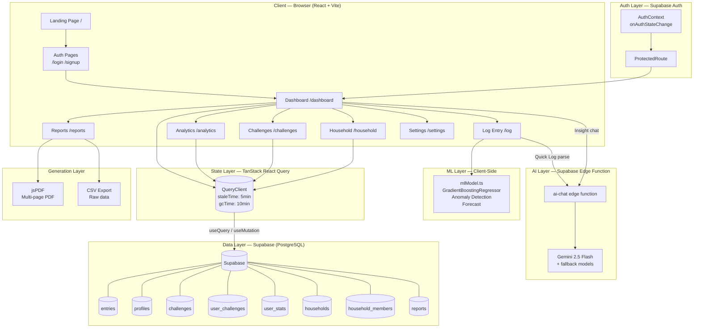
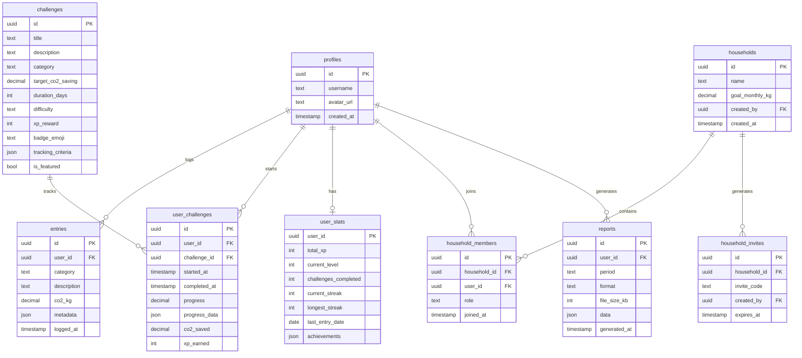
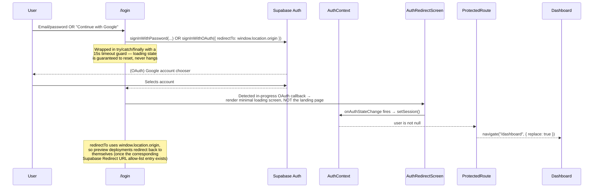
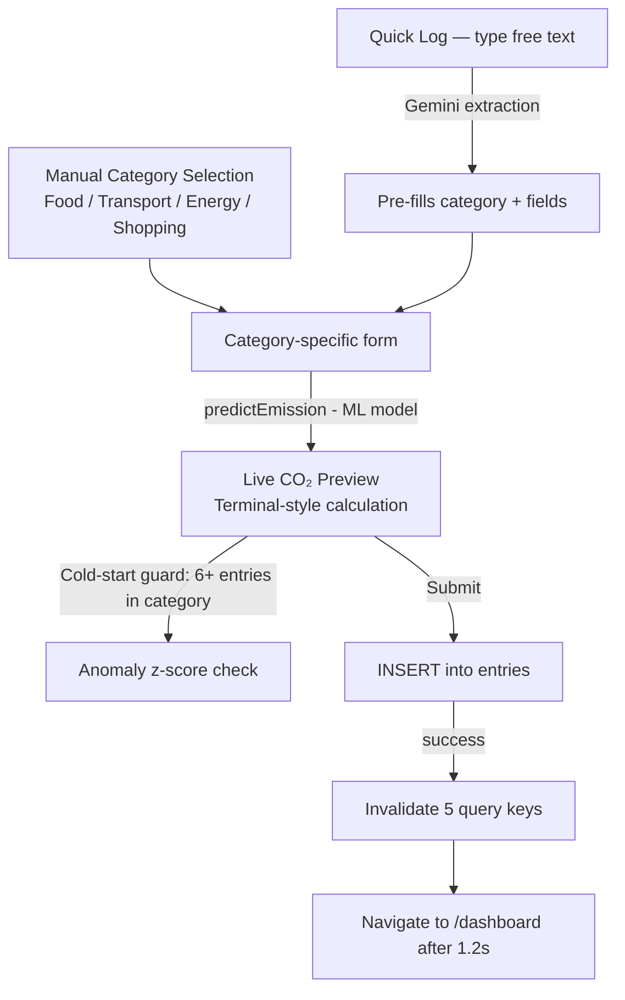
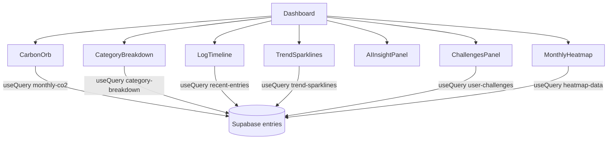
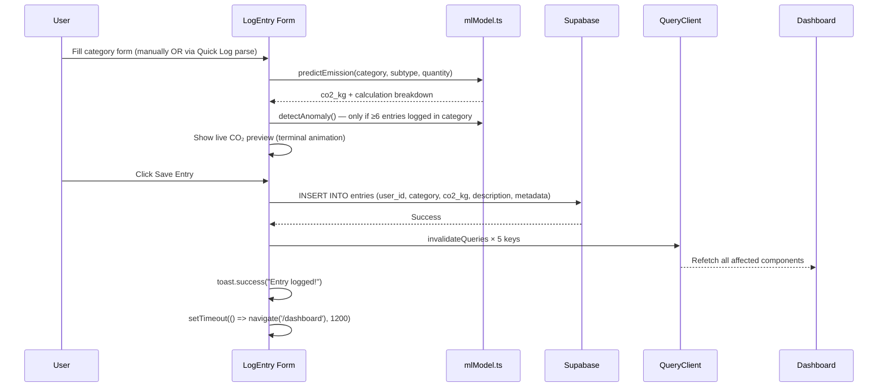
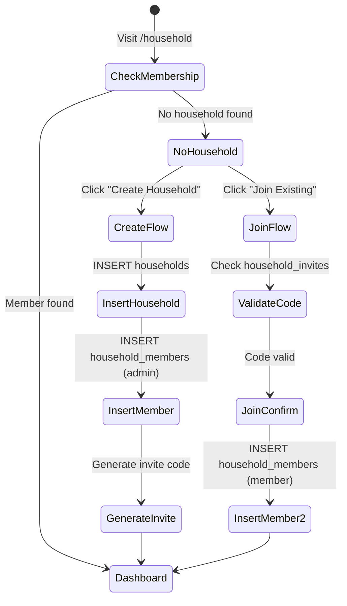
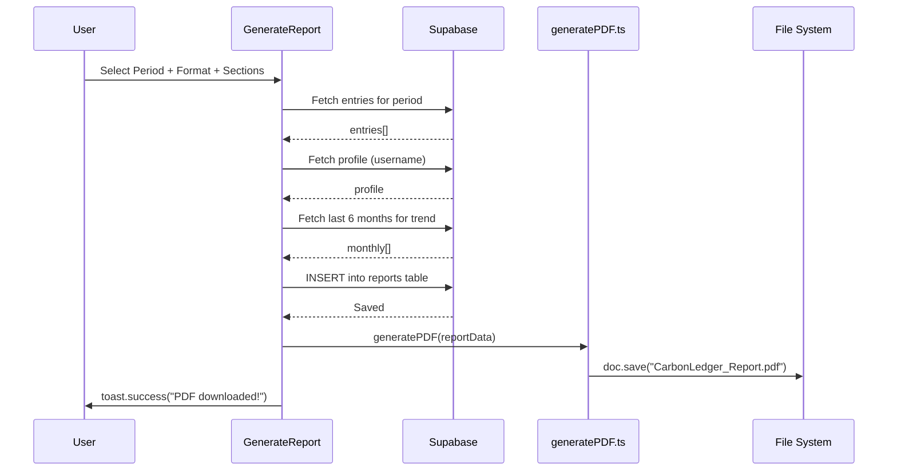

# CarbonLedger — Climate Operations Center

> **"Your planet. Your numbers. Your move."**

CarbonLedger is a full-stack personal carbon intelligence platform built on React + Vite + Supabase. It transforms raw lifestyle choices into real-time emission data using a trained machine learning model, lets users log activity in plain English via natural-language parsing, surfaces AI-generated insights grounded in the user's own data, drives behavior change through a gamified challenge system, and enables households to track and reduce their collective carbon footprint — all wrapped in a NASA mission-control aesthetic.

---

## Table of Contents

1. [Project Overview](#1-project-overview)
2. [Tech Stack](#2-tech-stack)
3. [Directory Structure](#3-directory-structure)
4. [Architecture Overview](#4-architecture-overview)
5. [Database Schema](#5-database-schema)
6. [Authentication Flow](#6-authentication-flow)
7. [Core Features & Pages](#7-core-features--pages)
8. [Component Architecture](#8-component-architecture)
9. [Data Flow Diagrams](#9-data-flow-diagrams)
10. [Machine Learning Emission Model](#10-machine-learning-emission-model)
11. [Quick Log — Natural Language Entry](#11-quick-log--natural-language-entry)
12. [AI Insights & RAG Chat](#12-ai-insights--rag-chat)
13. [Theme System](#13-theme-system)
14. [Gamification Engine](#14-gamification-engine)
15. [Household System](#15-household-system)
16. [Reports & PDF Generation](#16-reports--pdf-generation)
17. [Responsive Layout & Navigation](#17-responsive-layout--navigation)
18. [Testing](#18-testing)
19. [Animation System](#19-animation-system)
20. [Environment Variables & Secrets](#20-environment-variables--secrets)
21. [Running the Project](#21-running-the-project)
22. [Design Language](#22-design-language)

---

## 1. Project Overview

CarbonLedger gives users full visibility into their personal carbon footprint across four emission categories and drives sustained reduction through machine learning, AI, gamification, and social accountability.

### Core Feature Matrix

| Feature | Description |
|---------|-------------|
| **ML-Based Emission Estimation** | Trained GradientBoostingRegressor predicts CO₂ from logged activity, replacing static lookup tables |
| **Quick Log (NLP)** | Type a plain-English sentence ("drove 40km to office") and have it parsed into a structured entry |
| **Real-Time Tracking** | Log emissions across Food, Transport, Energy, Shopping |
| **AI Insights & Chat** | Gemini-powered pattern detection, anomaly alerts, reduction tips, and a chat interface grounded in the user's own logged data |
| **Gamification** | XP system, levels, streaks, 24 challenges, achievement badges |
| **Household Mode** | Multi-user households with leaderboards, shared goals, activity feeds |
| **Analytics** | Trend charts, heatmaps, category deep-dives, ML-based month-end forecasting |
| **Reports** | Professional multi-page PDF exports and CSV data exports |
| **Per-User Theming** | Accent color and density preferences persist per account across devices |
| **Mission Control UI** | Status indicators, live activity feed, real-time dashboard |

### Emission Categories

| Category | Tracked Items |
|----------|--------------|
| 🍽️ **Food** | Meals, dietary choices, food sourcing |
| 🚗 **Transport** | Car, bike, transit, flights |
| ⚡ **Energy** | Electricity, gas, heating, appliances |
| 🛍️ **Shopping** | Products, clothing, electronics |

---

## 2. Tech Stack

| Layer | Technology | Version |
|-------|-----------|---------|
| Framework | React (Vite) | ^18.3.1 |
| Language | TypeScript | ^5.8.3 |
| Routing | React Router DOM | ^6.30.1 |
| Styling | Tailwind CSS | ^3.4.17 |
| Animations | Framer Motion | ^12.38.0 |
| Animations (Physics) | @react-spring/web | ^10.0.3 |
| Advanced Animations | GSAP | ^3.15.0 |
| Charts | Recharts | ^2.15.4 |
| State / Async | TanStack React Query | ^5.83.0 |
| Database & Auth | Supabase (PostgreSQL + Auth) | ^2.102.1 |
| Forms | React Hook Form + Zod | ^7.61.1 / ^3.25.76 |
| PDF Generation | jsPDF + jsPDF-AutoTable | ^4.2.1 / ^5.0.7 |
| Icons | Lucide React | ^0.462.0 |
| Toast Notifications | Sonner | ^1.7.4 |
| UI Components | Radix UI (full suite, incl. Popover Portal) | Various |
| Lottie Animations | lottie-react | ^2.4.1 |
| Date Utilities | date-fns | ^3.6.0 |
| **ML — Serving** | Custom-trained GradientBoostingRegressor, coefficients exported to TypeScript | — |
| **ML — Training** | Python, scikit-learn (offline training pipeline, `train_model.py`) | — |
| **Generative AI** | Google Gemini (`gemini-2.5-flash` with multi-model fallback) via Supabase Edge Function | — |
| Testing | Vitest | ^3.2.4 |
| Hosting | Vercel (auto-deploy on push, per-branch preview URLs) | — |

---

## 3. Directory Structure

```
carbon-zen-flow/
│
├── src/
│   ├── App.tsx                          # Root app, QueryClient, routing, AnimatePresence
│   ├── main.tsx                         # React entry point + chunk-load failure recovery
│   ├── index.css                        # Global CSS + Mission Control design tokens
│   │
│   ├── pages/                           # Route-level page components
│   │   ├── Index.tsx                    # Landing page (public, fixed-green theme, isolated from user theme)
│   │   ├── Login.tsx                    # Authentication — Sign in (email/password + Google OAuth)
│   │   ├── Signup.tsx                   # Authentication — Register
│   │   ├── ForgotPassword.tsx           # Password reset flow
│   │   ├── UpdatePassword.tsx           # Password update (from reset link)
│   │   ├── Dashboard.tsx                # Main mission control dashboard
│   │   ├── LogEntry.tsx                 # Carbon emission log form + Quick Log NLP input
│   │   ├── Analytics.tsx                # Data intelligence command center
│   │   ├── Challenges.tsx               # Gamification engine
│   │   ├── Household.tsx                # Multi-user household tracking
│   │   ├── Reports.tsx                  # PDF/CSV report generation
│   │   ├── Settings.tsx                 # User preferences, theme, ML model info card
│   │   ├── CommandCenterTest.tsx        # Dev test page
│   │   └── NotFound.tsx                 # 404 page
│   │
│   ├── components/
│   │   ├── landing/                     # Landing page sections
│   │   │   ├── Navbar.tsx               # Marketing navigation
│   │   │   ├── HeroSection.tsx          # Split-screen cinematic hero (honest feature pills, no fabricated stats)
│   │   │   ├── MissionControlPreview.tsx # Animated preview widget, labeled "Sample Preview"
│   │   │   ├── ParticleHero.tsx         # Multi-layer particle system
│   │   │   ├── AuthRedirectScreen.tsx   # Minimal loading screen shown during OAuth callback (no landing-page flash)
│   │   │   ├── ProblemSection.tsx       # The climate problem statement
│   │   │   ├── SolutionSection.tsx      # CarbonLedger solution
│   │   │   ├── HowItWorksSection.tsx    # 3-step explainer
│   │   │   ├── ComparisonSection.tsx    # Free vs Premium comparison
│   │   │   ├── TestimonialsSection.tsx  # Social proof
│   │   │   ├── PricingSection.tsx       # ₹299/month premium pricing
│   │   │   └── Footer.tsx               # Site footer
│   │   │
│   │   ├── dashboard/                   # Core dashboard widgets
│   │   │   ├── DashboardSidebar.tsx     # Persistent (non-scrolling) sidebar, expand/collapse, full labels
│   │   │   ├── DashboardHeader.tsx      # Top bar with status indicators + notification popover
│   │   │   ├── StatusIndicators.tsx     # TRACKING · SYNC · AI status dots
│   │   │   ├── CarbonOrb.tsx            # Main 3D-style planet orb widget
│   │   │   ├── CategoryBreakdown.tsx    # Donut chart + liquid fill legend
│   │   │   ├── LogTimeline.tsx          # Live activity feed (terminal style)
│   │   │   ├── TrendSparklines.tsx      # 4-category sparkline mini-charts
│   │   │   ├── AIInsightPanel.tsx       # AI insight cards + Gemini-powered chat
│   │   │   ├── ChallengesPanel.tsx      # Active challenges mini-panel
│   │   │   ├── MonthlyHeatmap.tsx       # GitHub-style contribution heatmap
│   │   │   └── CountUp.tsx              # Reusable animated number counter
│   │   │
│   │   ├── analytics/                   # Analytics page components
│   │   │   ├── AnalyticsHeader.tsx      # Command center header + range filter
│   │   │   ├── TrendChart.tsx           # Multi-series recharts line chart
│   │   │   ├── ActivityHeatmap.tsx      # Day-of-week activity grid
│   │   │   ├── CategoryDeepDive.tsx     # Stacked category breakdown
│   │   │   ├── PatternInsights.tsx      # ML-based forecast (linear regression) + pattern cards
│   │   │   └── EntriesTable.tsx         # Searchable/sortable entries table
│   │   │
│   │   ├── challenges/                  # Gamification components
│   │   │   ├── ChallengesHeader.tsx     # XP bar, level, streak display
│   │   │   ├── ActiveChallenges.tsx     # In-progress challenge cards
│   │   │   ├── AvailableChallenges.tsx  # Challenge browser with filters
│   │   │   └── CompletedChallenges.tsx  # Victory timeline + impact summary
│   │   │
│   │   ├── household/                   # Multi-user household components
│   │   │   ├── HouseholdHeader.tsx      # Name, member count, edit controls
│   │   │   ├── HouseholdOverview.tsx    # Combined total + goal progress
│   │   │   ├── Leaderboard.tsx          # Ranked members by lowest emissions
│   │   │   ├── MemberCards.tsx          # Individual member cards + sparklines
│   │   │   ├── ActivityFeed.tsx         # Real-time household activity stream
│   │   │   ├── InviteSection.tsx        # Shareable invite link generator
│   │   │   ├── InviteModal.tsx          # Create/join household modal
│   │   │   └── SharedChallenges.tsx     # Household-wide challenges
│   │   │
│   │   ├── reports/                     # Report generation components
│   │   │   ├── ReportsHeader.tsx        # Reports page header + upgrade CTA
│   │   │   ├── GenerateReport.tsx       # Period/format selector + generate
│   │   │   ├── ReportPreview.tsx        # Inline preview + download buttons
│   │   │   ├── ReportHistory.tsx        # Past reports list + actions
│   │   │   ├── ScheduledReports.tsx     # Auto-generation toggles
│   │   │   └── UpgradeCTA.tsx           # Premium upsell component
│   │   │
│   │   ├── log-entry/                   # Category-specific log forms
│   │   │   ├── QuickLogInput.tsx        # Natural-language entry box (Gemini-powered extraction)
│   │   │   ├── FoodForm.tsx             # Food emission calculator (ML-predicted, controlled inputs)
│   │   │   ├── TransportForm.tsx        # Transport distance calculator (ML-predicted, controlled inputs)
│   │   │   ├── EnergyForm.tsx           # Energy consumption calculator (ML-predicted)
│   │   │   └── ShoppingForm.tsx         # Shopping impact calculator (ML-predicted, controlled inputs)
│   │   │
│   │   ├── settings/                    # Settings page sections
│   │   │   ├── SettingsNav.tsx          # Section navigation tabs
│   │   │   ├── ProfileSection.tsx       # Name, avatar, personal info
│   │   │   ├── TargetsSection.tsx       # Monthly CO₂ targets
│   │   │   ├── AppearanceSection.tsx    # Accent color + density, persisted per user
│   │   │   ├── NotificationsSection.tsx # Alert preferences
│   │   │   ├── PrivacySection.tsx       # Data privacy controls
│   │   │   ├── BillingSection.tsx       # Premium subscription
│   │   │   └── DangerZoneSection.tsx    # Account deletion
│   │   │
│   │   └── ui/                          # Shared atomic UI components
│   │       ├── ErrorBoundary.tsx        # React error boundary
│   │       ├── ErrorCard.tsx            # Error display card
│   │       ├── SkeletonCard.tsx         # Loading skeleton
│   │       ├── LiveImpactStream.tsx     # "Sample Preview" activity stream widget (landing page)
│   │       └── [Radix UI components]    # Full Radix UI component library, incl. Popover w/ Portal
│   │
│   ├── contexts/
│   │   ├── AuthContext.tsx              # Supabase auth state + user session
│   │   └── ThemeContext.tsx             # Per-user theme (accent color, density) — see Section 13
│   │
│   ├── hooks/
│   │   ├── useDashboardData.ts          # Centralized dashboard data hook
│   │   └── use-mobile.tsx               # Responsive breakpoint hook
│   │
│   ├── lib/
│   │   ├── animations.ts                # Reusable Framer Motion variants
│   │   └── utils.ts                     # Tailwind class merge utility
│   │
│   ├── services/
│   │   └── quickLogService.ts           # Calls the ai-chat edge function in `quick-log` mode, normalizes/validates response
│   │
│   ├── utils/
│   │   ├── mlModel.ts                   # GradientBoostingRegressor coefficients + predictEmission / detectAnomaly / forecastMonthEnd
│   │   ├── generatePDF.ts               # jsPDF multi-page report generator
│   │   └── generateCSV.ts               # CSV export utility
│   │
│   ├── test/
│   │   ├── mlModel.test.ts              # ML prediction, anomaly guard, forecast guard tests
│   │   ├── quickLog.test.ts             # NLP parsing, round-trip distance, enum-safety tests
│   │   └── theme.test.ts                # Theme persistence / fallback sync tests
│   │
│   └── integrations/
│       └── supabase/
│           ├── client.ts                # Supabase client singleton
│           └── types.ts                 # Auto-generated DB TypeScript types
│
├── supabase/
│   ├── functions/
│   │   └── ai-chat/
│   │       └── index.ts                 # Gemini-backed edge function: chat mode + quick-log extraction mode
│   ├── migrations/                      # SQL migrations (RLS policies, schema, theme_color column)
│   └── config.toml                      # Supabase project configuration
│
├── train_model.py                       # Offline scikit-learn training pipeline for the emission model (academic proof-of-work)
├── public/                              # Static assets
├── vite.config.ts                       # Vite + path aliases + manualChunks code-splitting config
├── tailwind.config.ts                   # Tailwind configuration
├── tsconfig.json                        # TypeScript configuration
└── package.json                         # Project manifest
```

---

## 4. Architecture Overview


```mermaid
graph TB
    subgraph "Client — Browser (React + Vite)"
        LP[Landing Page /] --> AUTH[Auth Pages\n/login /signup]
        AUTH --> DASH[Dashboard /dashboard]
        DASH --> LOG[Log Entry /log]
        DASH --> ANA[Analytics /analytics]
        DASH --> CHL[Challenges /challenges]
        DASH --> HSH[Household /household]
        DASH --> RPT[Reports /reports]
        DASH --> SET[Settings /settings]
    end

    subgraph "State Layer — TanStack React Query"
        QC[(QueryClient\nstaleTime: 5min\ngcTime: 10min)]
        DASH --> QC
        ANA --> QC
        CHL --> QC
        HSH --> QC
    end

    subgraph "Auth Layer — Supabase Auth"
        AC[AuthContext\nonAuthStateChange]
        PR[ProtectedRoute]
        AC --> PR
        PR --> DASH
    end

    subgraph "ML Layer — Client-Side"
        ML[mlModel.ts\nGradientBoostingRegressor\nAnomaly Detection\nForecast]
        LOG --> ML
    end

    subgraph "AI Layer — Supabase Edge Function"
        EF[ai-chat edge function]
        GEM[Gemini 2.5 Flash\n+ fallback models]
        EF --> GEM
        LOG -->|Quick Log parse| EF
        DASH -->|Insight chat| EF
    end

    subgraph "Data Layer — Supabase (PostgreSQL)"
        SB[(Supabase)]
        entries[(entries)]
        profiles[(profiles)]
        challenges[(challenges)]
        user_challenges[(user_challenges)]
        user_stats[(user_stats)]
        households[(households)]
        household_members[(household_members)]
        reports[(reports)]
        SB --- entries
        SB --- profiles
        SB --- challenges
        SB --- user_challenges
        SB --- user_stats
        SB --- households
        SB --- household_members
        SB --- reports
    end

    subgraph "Generation Layer"
        PDF[jsPDF\nMulti-page PDF]
        CSV[CSV Export\nRaw data]
    end

    QC -->|useQuery / useMutation| SB
    RPT --> PDF
    RPT --> CSV
```

---

## 5. Database Schema


```mermaid
erDiagram
    profiles {
        uuid id PK
        text username
        text avatar_url
        timestamp created_at
    }
    entries {
        uuid id PK
        uuid user_id FK
        text category
        text description
        decimal co2_kg
        json metadata
        timestamp logged_at
    }
    challenges {
        uuid id PK
        text title
        text description
        text category
        decimal target_co2_saving
        int duration_days
        text difficulty
        int xp_reward
        text badge_emoji
        json tracking_criteria
        bool is_featured
    }
    user_challenges {
        uuid id PK
        uuid user_id FK
        uuid challenge_id FK
        timestamp started_at
        timestamp completed_at
        decimal progress
        json progress_data
        decimal co2_saved
        int xp_earned
    }
    user_stats {
        uuid user_id PK
        int total_xp
        int current_level
        int challenges_completed
        int current_streak
        int longest_streak
        date last_entry_date
        json achievements
    }
    households {
        uuid id PK
        text name
        decimal goal_monthly_kg
        uuid created_by FK
        timestamp created_at
    }
    household_members {
        uuid id PK
        uuid household_id FK
        uuid user_id FK
        text role
        timestamp joined_at
    }
    household_invites {
        uuid id PK
        uuid household_id FK
        text invite_code
        uuid created_by FK
        timestamp expires_at
    }
    reports {
        uuid id PK
        uuid user_id FK
        text period
        text format
        int file_size_kb
        json data
        timestamp generated_at
    }

    profiles ||--o{ entries : "logs"
    profiles ||--o{ user_challenges : "starts"
    profiles ||--o| user_stats : "has"
    profiles ||--o{ household_members : "joins"
    challenges ||--o{ user_challenges : "tracks"
    households ||--o{ household_members : "contains"
    households ||--o{ household_invites : "generates"
    profiles ||--o{ reports : "generates"
```

### Row Level Security (RLS) Strategy

Every table has RLS enabled. Users can only read and write their own rows:

```sql
-- Standard pattern applied to entries, user_challenges, user_stats, reports
CREATE POLICY "Users manage own rows"
  ON [table] FOR ALL
  USING (auth.uid() = user_id);

-- Household members use a SECURITY DEFINER helper to prevent infinite recursion
CREATE OR REPLACE FUNCTION get_user_household_ids()
RETURNS SETOF uuid LANGUAGE sql SECURITY DEFINER AS $$
  SELECT household_id FROM household_members WHERE user_id = auth.uid()
$$;

CREATE POLICY "View members in user households"
  ON household_members FOR SELECT
  USING (household_id IN (SELECT get_user_household_ids()));
```

---

## 6. Authentication Flow


```mermaid
sequenceDiagram
    participant U as User
    participant LG as /login
    participant SB as Supabase Auth
    participant AC as AuthContext
    participant ARS as AuthRedirectScreen
    participant PR as ProtectedRoute
    participant DB as Dashboard

    U->>LG: Email/password OR "Continue with Google"
    LG->>SB: signInWithPassword(...) OR signInWithOAuth({ redirectTo: window.location.origin })
    Note over LG: Wrapped in try/catch/finally with a<br/>15s timeout guard — loading state<br/>is guaranteed to reset, never hangs
    SB-->>U: (OAuth) Google account chooser
    U->>SB: Selects account
    SB-->>LG: #access_token=... on redirect
    LG->>ARS: Detected in-progress OAuth callback →<br/>render minimal loading screen, NOT the landing page
    ARS->>AC: onAuthStateChange fires → setSession()
    AC-->>PR: user is not null
    PR-->>DB: navigate("/dashboard", { replace: true })

    Note over LG: redirectTo uses window.location.origin,<br/>so preview deployments redirect back to<br/>themselves (once the corresponding<br/>Supabase Redirect URL allow-list entry exists)
```

### AuthContext Design

- Single source of truth: `onAuthStateChange` sets both `session` and `loading`
- `getSession()` is intentionally NOT called to eliminate the double-render race condition
- `ProtectedRoute` redirects to `/login` when `user === null && !loading`
- Session persists across tabs and page refreshes via Supabase's built-in persistence
- Sign-in calls are wrapped in `try/catch/finally` with a 15-second timeout guard, so a stalled network request can never leave the UI stuck on "Signing in…"
- The public landing page (`/`) never renders during an in-progress OAuth callback — an `AuthRedirectScreen` is shown instead, avoiding a flash of marketing content in the wrong theme

---

## 7. Core Features & Pages

### Landing Page (`/`)

Cinematic split-screen hero with:
- Animated gradient headline (Syne font, 80px)
- `MissionControlPreview` widget, explicitly labeled **"Sample Preview"** — no fabricated data is presented as if it were live
- Multi-layer particle system (`ParticleHero`)
- Honest, qualitative feature pills (e.g. "Personal & household tracking," "AI-powered insights") instead of unverified numeric claims
- Magnetic CTA buttons
- Sections: Problem → Solution → How It Works → Comparison → Testimonials → Pricing → Footer
- **Always renders in a fixed green theme**, regardless of any signed-in user's personal accent color — the public marketing page never inherits per-account theming (see [Section 13](#13-theme-system))

**Pricing**: Free tier + Premium at ₹299/month

---

### Dashboard (`/dashboard`)

Mission Control layout with 4 rows:

```
Row 1: [CarbonOrb 5col] [CategoryBreakdown 4col] [ChallengesPanel 3col]
Row 2: [TrendSparklines 5col] [LogTimeline 7col]
Row 3: [AIInsightPanel — full width]
Row 4: [MonthlyHeatmap — full width]
```

All components query Supabase directly via `useQuery`. Cache is invalidated after every log entry via `queryClient.invalidateQueries`.

**After log entry, these queries are invalidated:**
- `["monthly-co2"]` → CarbonOrb
- `["recent-entries"]` → LogTimeline
- `["category-breakdown"]` → CategoryBreakdown
- `["trend-sparklines"]` → TrendSparklines
- `["user-challenges"]` → ChallengesPanel

---

### Log Entry (`/log`)


```mermaid
flowchart TD
    QL[Quick Log — type free text] -->|Gemini extraction| PREFILL[Pre-fills category + fields]
    CAT[Manual Category Selection\nFood / Transport / Energy / Shopping] --> FORM[Category-specific form]
    PREFILL --> FORM
    FORM -->|predictEmission - ML model| PREVIEW[Live CO₂ Preview\nTerminal-style calculation]
    PREVIEW -->|Cold-start guard: 6+ entries in category| ANOMALY[Anomaly z-score check]
    PREVIEW -->|Submit| INSERT[INSERT into entries]
    INSERT -->|success| INVALIDATE[Invalidate 5 query keys]
    INVALIDATE --> NAVIGATE[Navigate to /dashboard after 1.2s]
```

**CO₂ Calculation**: Each category form computes `co2_kg` client-side using the trained ML model in `mlModel.ts` — see [Section 10](#10-machine-learning-emission-model). Whether the fields were filled manually or via Quick Log's NLP parsing, the exact same prediction pipeline runs — there is no separate calculation path for either input method. Metadata (meal type, distance, fuel type, etc.) is stored in the `metadata` jsonb column.

---

### Analytics (`/analytics`)

Data fetched at page level and passed as props to all child components:

| Component | Data Source |
|-----------|------------|
| `AnalyticsHeader` | Aggregate totals from all entries |
| `TrendChart` | Entries grouped by month (last 6 months) |
| `ActivityHeatmap` | Entries grouped by day-of-week |
| `CategoryDeepDive` | Entries grouped by category |
| `PatternInsights` | ML-based month-end forecast (linear regression once ≥5 days logged; simple average projection before that) |
| `EntriesTable` | Paginated raw entries (searchable, sortable) |

**Range options**: This Month · Last 3 Months · This Year · All Time

---

### Challenges (`/challenges`)

Full gamification engine. See [Section 14](#14-gamification-engine) for detail.

---

### Household (`/household`)

Multi-user carbon accountability system. See [Section 15](#15-household-system) for detail.

---

### Reports (`/reports`)

Professional report generation system. See [Section 16](#16-reports--pdf-generation) for detail.

---

### Settings (`/settings`)

Tabbed sections:

| Tab | Function |
|-----|---------|
| Profile | Name, avatar, personal info (saves to `profiles` table) |
| Targets | Monthly CO₂ target (default: 350 kg) |
| Appearance | Accent color (5 options) + density, persisted per user — see [Section 13](#13-theme-system) |
| Notifications | Alert preferences |
| Privacy | Data controls |
| Billing | Premium subscription management |
| Danger Zone | Account deletion |

Also displays an **AI & ML Emission Model** card with the trained model's algorithm, R² score, mean absolute error, training sample count, and an explicit disclosure that the model is trained on a synthetic dataset derived from IPCC AR6 / EPA / IEA emission factors rather than live-measured emissions.

---

## 8. Component Architecture

### Dashboard Data Hierarchy


```mermaid
graph TB
    Dashboard --> CarbonOrb
    Dashboard --> CategoryBreakdown
    Dashboard --> LogTimeline
    Dashboard --> TrendSparklines
    Dashboard --> AIInsightPanel
    Dashboard --> ChallengesPanel
    Dashboard --> MonthlyHeatmap

    CarbonOrb -->|useQuery monthly-co2| SB[(Supabase entries)]
    CategoryBreakdown -->|useQuery category-breakdown| SB
    LogTimeline -->|useQuery recent-entries| SB
    TrendSparklines -->|useQuery trend-sparklines| SB
    ChallengesPanel -->|useQuery user-challenges| SB
    MonthlyHeatmap -->|useQuery heatmap-data| SB
```

### Reusable Shared Components

| Component | Purpose | Used In |
|-----------|---------|---------|
| `CountUp` | Animated number counter | CarbonOrb, Analytics |
| `SkeletonCard` | Loading skeleton placeholder | All data components |
| `ErrorCard` | Error display with retry | All data components |
| `ErrorBoundary` | React error boundary (class) | App root |
| `StatusIndicators` | Live system status dots | DashboardHeader |
| `MissionControlPreview` | Animated "Sample Preview" widget | Landing HeroSection |
| `AuthRedirectScreen` | Minimal loading state during OAuth callback | Index.tsx |

---

## 9. Data Flow Diagrams

### Entry Logging Flow


```mermaid
sequenceDiagram
    participant U as User
    participant LF as LogEntry Form
    participant ML as mlModel.ts
    participant SB as Supabase
    participant QC as QueryClient
    participant DASH as Dashboard

    U->>LF: Fill category form (manually OR via Quick Log parse)
    LF->>ML: predictEmission(category, subtype, quantity)
    ML-->>LF: co2_kg + calculation breakdown
    LF->>ML: detectAnomaly() — only if ≥6 entries logged in category
    LF->>LF: Show live CO₂ preview (terminal animation)
    U->>LF: Click Save Entry
    LF->>SB: INSERT INTO entries (user_id, category, co2_kg, description, metadata)
    SB-->>LF: Success
    LF->>QC: invalidateQueries × 5 keys
    QC-->>DASH: Refetch all affected components
    LF->>LF: toast.success("Entry logged!")
    LF->>LF: setTimeout(() => navigate('/dashboard'), 1200)
```

### QueryClient Configuration

```typescript
const queryClient = new QueryClient({
  defaultOptions: {
    queries: {
      staleTime: 1000 * 60 * 5,      // Fresh for 5 minutes
      gcTime: 1000 * 60 * 10,         // Cache lives 10 minutes
      retry: 1,
      refetchOnWindowFocus: false,
      refetchOnReconnect: false,
    },
  },
})
```

---

## 10. Machine Learning Emission Model

CarbonLedger's carbon estimates are produced by a trained regression model rather than a static emission-factor lookup table.

### Model Details

| Property | Value |
|---|---|
| Algorithm | GradientBoostingRegressor (scikit-learn) |
| R² Score | 0.995 |
| Mean Absolute Error | ±4.134 kg CO₂ |
| Training samples | 4,000 (synthetic) |
| Input features | 13 |
| Cross-validation | 5-fold, CV R² = 0.9965 |

**Training methodology**: `train_model.py` generates a synthetic dataset from IPCC AR6, EPA, and IEA emission-factor formulas, trains the model offline, and extracts its coefficients into `src/utils/mlModel.ts` for real-time in-browser inference — no server-side inference call is needed at prediction time.

**Honesty note**: because the training data is itself derived from known emission-factor formulas rather than live-measured emissions, the high R² reflects the model's ability to approximate those formulas closely — it is best described as *a supervised regression model validated against a physics/factor-derived synthetic dataset*, not as having learned from real-world observed data. This is disclosed directly to users in the Settings page's model info card.

### Additional Statistical Features

- **Anomaly detection** (`detectAnomaly`): flags entries more than 2σ (high) or 3σ (extreme) from a category's recent history. Guarded against cold-start false positives — does not activate until at least 6 entries exist in that category.
- **Month-end forecasting** (`forecastMonthEnd`): ordinary least-squares linear regression on daily totals once ≥5 days of data exist in the current month; falls back to a simple average-based projection before that, to avoid unstable early-month slope estimates.

### Front-End Reliability Safeguards

- The ML module is code-split into its own lazy-loaded chunk (`ml-*.js`, ~9.5 kB) rather than bundled into the main app, reducing initial load size.
- If that chunk fails to load (e.g. a stale browser tab spanning a new deploy), the affected UI shows a "please refresh" fallback instead of hanging or crashing — verified via a scoped resilience test.

---

## 11. Quick Log — Natural Language Entry

Users can type a plain-English description of an activity — e.g. *"drove 40km to office and back"*, *"had a chicken burger for lunch"*, *"ran the AC for 3 hours"* — instead of using the manual form controls.

### How it works

1. Text is sent to the `ai-chat` Supabase Edge Function with `type: "quick-log"`.
2. The function calls Gemini with a **structured JSON extraction prompt** (`responseMimeType: "application/json"`, low temperature) rather than a conversational prompt, returning `{ category, subtype, quantity, unit, confidence }`.
3. `quickLogService.ts` normalizes common aliases (e.g. `petrol_car` → `car_petrol`) to guarantee the returned subtype always matches the exact enum keys the emission model expects.
4. Parsed fields **pre-fill the existing manual form** — they do not bypass it. The user reviews and can edit every field, then submits normally. This is a deliberate human-in-the-loop design: the LLM extracts structure, it never estimates the emission number itself, and nothing is auto-submitted on a low-confidence guess.
5. Round-trip phrasing ("...and back", "round trip") is explicitly handled via few-shot examples in the extraction prompt, so distance is correctly doubled when appropriate and left as-is otherwise.
6. Ambiguous input (e.g. "had some food") returns a low-confidence/failure state rather than a fabricated guess, surfaced to the user as "Double-check these" or "Couldn't parse that — try the form below."

### Reliability

- The edge function validates the Supabase JWT before making any Gemini call, so an unauthenticated request can never consume API quota.
- The Parse button and Enter-key handler are both guarded against double-submission while a request is in flight.
- Multiple Gemini model candidates (`gemini-2.5-flash`, `gemini-2.5-flash-lite`, `gemini-flash-latest`, `gemini-flash-lite-latest`) are tried in sequence, so a free-tier quota limit on one model falls back to the next rather than failing outright.

---

## 12. AI Insights & RAG Chat

The dashboard's `AIInsightPanel` surfaces three insight types, backed by a real Gemini-powered edge function (not a static/simulated response):

| Card Type | Icon | Description |
|-----------|------|-------------|
| PATTERN | 📊 | Behavioral patterns detected from entry history |
| ACTION | ⚡ | Specific recommended actions for highest impact |
| FORECAST | 🔮 | ML-based projected end-of-month total (see [Section 10](#10-machine-learning-emission-model)) |

### "Ask your data anything" Chat

- Retrieves the user's own recent entries as context (retrieval-augmented generation) before calling Gemini, so responses are grounded in that user's actual logged activity rather than generic advice.
- The input is width-constrained (`max-w-[720px]`, centered) rather than spanning the full dashboard width.
- The response popover is rendered via a Radix UI Portal directly to `document.body`, so it is never visually clipped by any ancestor container's `overflow: hidden` — this specifically fixed an earlier bug where the notification bell popover was invisibly clipped after layout overflow fixes were introduced elsewhere in the app.

---

## 13. Theme System

Each user's accent color (5 options) and density preference are personal settings, entirely separate from the public landing page's appearance.

- **Landing page (`/`) is always rendered in a fixed green theme**, isolated via its own CSS scope (`.landing-theme`) — it never reflects any signed-in or previously-signed-in user's personal theme.
- **Per-user persistence**: theme is stored both in a user-namespaced local cache key (`cz-accent-${userId}`) and in Supabase Auth user metadata (`supabase.auth.updateUser({ data: { theme_color } })`), so it survives across devices and browser sessions, not just the current browser.
- **Applied on login**: the authenticated app reads and applies the signed-in user's saved theme as soon as the session resolves, rather than showing a default color momentarily.
- Verified independently for two accounts with two different saved colors to confirm no cross-account bleed.

---

## 14. Gamification Engine

### XP & Leveling System

```
Level = floor(total_xp / 1000) + 1
XP in current level = total_xp % 1000
XP to next level = 1000 - (total_xp % 1000)

Level Titles:
1 → Beginner
2 → Carbon Aware
3 → Eco Warrior
4 → Carbon Reducer
5 → Climate Champion
6 → Planet Guardian
7 → Earth Hero
8 → Sustainability Legend
```

### XP Rewards by Difficulty

| Difficulty | XP Range |
|-----------|---------|
| Easy | 150–220 XP |
| Medium | 240–320 XP |
| Hard | 350–500 XP |

### Challenge Progress Tracking

```mermaid
flowchart TD
    START[User starts challenge] --> INSERT[INSERT user_challenges\nstarted_at = now()]
    INSERT --> TRACK[Progress tracked via\ncalculate_challenge_progress SQL function]
    TRACK --> CHECK{progress >= 100%?}
    CHECK -->|No| DISPLAY[Show progress bar + days left]
    CHECK -->|Yes| COMPLETE[SET completed_at = now]
    COMPLETE --> AWARD[Award xp_earned to user_stats]
    AWARD --> STREAK[Update current_streak]
    STREAK --> ACHIEVE[Check achievement unlocks]
    ACHIEVE --> TOAST[🎉 Toast notification]
```

### 24 Seeded Challenges

| Category | Challenges | Difficulty Range |
|---------|-----------|----------------|
| 🍽️ Food | Plant-Powered Week, Meatless Monday Champion, Local Food Hero, Zero Food Waste, Meal Prep Master | Easy–Hard |
| 🚗 Transport | Car-Free Week, Bike Commute Streak, Public Transit Convert, Walking Warrior, No-Fly Month | Easy–Hard |
| ⚡ Energy | Lights Out at 9, Vampire Power Slayer, Cold Shower Challenge, AC-Free Week, Energy Audit Pro | Easy–Hard |
| 🛍️ Shopping | Buy Nothing Week, Second-Hand Hero, Minimalist Month, Package-Free Shopping | Easy–Hard |
| 🌱 Lifestyle | Zero Waste Week, Plastic-Free Fortnight, Digital Detox Weekend, Community Impact, Carbon Education | Easy–Hard |

### Achievement Badges

| Achievement | Trigger |
|-------------|---------|
| 🚶 First Steps | Complete first challenge |
| 🔥 Week Warrior | 7-day streak |
| 🌍 100kg Saver | Save 100 kg cumulative |
| ⚡ Speed Demon | Complete challenge in <50% of duration |
| 🏆 Perfectionist | Complete 3 Hard challenges |
| 🥇 Category Master | Complete 5 challenges in one category |

---

## 15. Household System

### State Machine


```mermaid
stateDiagram-v2
    [*] --> CheckMembership: Visit /household
    CheckMembership --> NoHousehold: No household found
    CheckMembership --> Dashboard: Member found

    NoHousehold --> CreateFlow: Click "Create Household"
    NoHousehold --> JoinFlow: Click "Join Existing"

    CreateFlow --> InsertHousehold: INSERT households
    InsertHousehold --> InsertMember: INSERT household_members (admin)
    InsertMember --> GenerateInvite: Generate invite code
    GenerateInvite --> Dashboard

    JoinFlow --> ValidateCode: Check household_invites
    ValidateCode --> JoinConfirm: Code valid
    JoinConfirm --> InsertMember2: INSERT household_members (member)
    InsertMember2 --> Dashboard
```

### Leaderboard Logic

Members ranked by **lowest total CO₂ this month** (ascending — greener is better):
- 🥇 Lowest emissions = Rank 1
- Current user row is highlighted with green glow
- Click member row → Expands to show their category breakdown

### RLS Infinite Recursion Fix

The `household_members` table uses a `SECURITY DEFINER` helper function to avoid infinite recursion in RLS policies:

```sql
CREATE OR REPLACE FUNCTION get_user_household_ids()
RETURNS SETOF uuid LANGUAGE sql SECURITY DEFINER
SET search_path = public STABLE AS $$
  SELECT household_id FROM household_members WHERE user_id = auth.uid()
$$;
```

This breaks the recursion loop: policy → function → direct query (no RLS) → result.

---

## 16. Reports & PDF Generation

### Generation Flow


```mermaid
sequenceDiagram
    participant U as User
    participant GR as GenerateReport
    participant SB as Supabase
    participant PDF as generatePDF.ts
    participant FS as File System

    U->>GR: Select Period + Format + Sections
    GR->>SB: Fetch entries for period
    SB-->>GR: entries[]
    GR->>SB: Fetch profile (username)
    SB-->>GR: profile
    GR->>SB: Fetch last 6 months for trend
    SB-->>GR: monthly[]
    GR->>SB: INSERT into reports table
    SB-->>GR: Saved
    GR->>PDF: generatePDF(reportData)
    PDF->>FS: doc.save("CarbonLedger_Report.pdf")
    GR->>U: toast.success("PDF downloaded!")
```

### PDF Structure (3 Pages)

**Page 1 — Cover & Summary:**
- CarbonLedger branded header (dark background)
- User name + report period
- Total CO₂ (large green number)
- Delta vs last month + status badge
- Category breakdown with animated progress bars
- Top AI insight

**Page 2 — Trend & Entries:**
- Monthly trend bar chart (last 6 months)
- Recent entries table (up to 15 entries, auto-paginated via jsPDF-AutoTable)
- Column widths: Date(25mm) Category(30mm) Description(90mm) CO₂(25mm)

**Page 3 — Insights & Challenges:**
- AI insights (all detected patterns)
- Active challenges progress
- CarbonLedger footer + generated timestamp

### CSV Export

Structured CSV with three sections:
1. Summary header (period, total CO₂)
2. Category breakdown table
3. All entries table (date, category, description, co2_kg)

---

## 17. Responsive Layout & Navigation

- **Persistent sidebar**: a single shared `DashboardSidebar` component is used identically across every authenticated page (Dashboard, Log Entry, Analytics, Challenges, Household, Reports, Settings) — it no longer scrolls away with page content on tall pages, and stays fixed via an independent-column scroll layout (`h-screen` sidebar, `overflow-y-auto` only on the main content area).
- **Collapse/expand**: the sidebar can collapse to an icon-only rail; the logo and the collapse toggle each have dedicated, non-overlapping space at every width.
- **Mobile**: a hamburger drawer exposes all navigation destinations consistently across every page at narrow viewport widths.
- **No horizontal scroll**: root containers (`html`, `body`, `#root`) and the main content column all constrain width (`overflow-x-hidden`, `min-w-0`, `max-w-full`), and grid/flex children use `minmax(0, 1fr)` rather than bare `1fr` so wide chart/table content can never force the page to overflow the viewport.
- **Code-split bundle**: `vite.config.ts` splits `vendor`, `supabase`, `charts`, and `ml` into separate chunks, reducing the initial JS payload and allowing the ML module to load lazily only on pages that need it.

---

## 18. Testing

Automated tests run via Vitest:

| Test File | Covers |
|---|---|
| `mlModel.test.ts` | Prediction accuracy per category, anomaly detection (including cold-start guard), forecast method switching (average vs. regression), unified prediction routing |
| `quickLog.test.ts` | Structured extraction across all four categories, round-trip distance doubling, enum-safety against the model's coefficient maps, ambiguous-input fallback, network-failure fallback |
| `theme.test.ts` | Fallback metadata sync between the live model constant and its Settings-page fallback copy |

```bash
npm test           # Run once
npm run test:watch # Watch mode
```

---

## 19. Animation System

### Global Design Tokens (`src/lib/animations.ts`)

```typescript
// Page transitions (used in AnimatedRoutes)
export const pageVariants = {
  initial: { opacity: 0, y: 20, scale: 0.98 },
  animate: { opacity: 1, y: 0, scale: 1 },
  exit: { opacity: 0, y: -20, scale: 0.98 }
}

// Stagger container for lists
export const staggerContainer = {
  initial: {},
  animate: { transition: { staggerChildren: 0.08 } }
}

// Individual item reveal
export const fadeInUp = {
  initial: { opacity: 0, y: 20 },
  animate: { opacity: 1, y: 0, transition: { duration: 0.5 } }
}

// Terminal-style sequential line reveal
export const terminalReveal = { ... }

// Carbon orb mount (scale + rotation)
export const orbMount = { ... }

// Data flash (green pulse on live update)
export const dataFlash = { ... }
```

### CSS Animation Keyframes (`src/index.css`)

| Keyframe | Purpose | Duration |
|----------|---------|---------|
| `grid-pulse` | Subtle grid background breathe | 4s loop |
| `data-flash` | Green flash on real-time updates | 0.6s |
| `terminal-blink` | Terminal cursor blink | 1s loop |
| `slide-up-in` | Entry slide from bottom | 0.3s |
| `gradient-shift` | Gradient text color cycle | 3s loop |
| `liquid-fill` | Bar fill shimmer effect | 2s |

### Mission Control CSS Classes

| Class | Applies |
|-------|---------|
| `.mission-card` | Dark glassmorphism card with green border |
| `.status-dot` | 8px animated status dot (green/amber/red) |
| `.terminal-line` | JetBrains Mono 13px green monospace |
| `.terminal-cursor` | Blinking block cursor |
| `.gradient-text-animated` | Animated gradient text fill |
| `.grid-background` | Subtle animated grid pattern |
| `.liquid-bar` | Progress bar with shimmer |
| `.mono-number` | Tabular numeral monospace display |

---

## 20. Environment Variables & Secrets

### Frontend (`.env`)

| Variable | Required | Description |
|----------|----------|--------------|
| `VITE_SUPABASE_URL` | Always | Supabase project URL |
| `VITE_SUPABASE_ANON_KEY` | Always | Supabase anonymous public key |

```env
VITE_SUPABASE_URL=https://your-project.supabase.co
VITE_SUPABASE_ANON_KEY=your-anon-key-here
```

### Supabase Edge Function Secrets

| Secret | Required | Description |
|---|---|---|
| `GEMINI_API_KEY` | For AI Insights + Quick Log | Google Gemini API key, set via the Supabase CLI or dashboard (Edge Functions → Secrets) — never committed to the repo |

### Supabase Auth — Redirect URL Configuration

Under **Authentication → URL Configuration → Redirect URLs** in the Supabase dashboard, the following should be present for OAuth login to work correctly on every environment:
- The production URL
- A wildcard pattern covering this project's Vercel preview deployments
- `http://localhost:5173/**` (or your local dev port) for local development

Without the preview wildcard, Google OAuth initiated from a preview deployment will redirect back to production instead of the preview it was started from — email/password login is unaffected by this since it never leaves the current domain.

---

## 21. Running the Project

### Prerequisites
- Node.js ≥ 18
- A Supabase project (free tier works)
- A Google Gemini API key (for AI Insights and Quick Log)
- Python 3.x + scikit-learn (only needed if retraining the ML model via `train_model.py`)

### Setup

```bash
# 1. Clone the repository
git clone https://github.com/Pawanrudupa/carbon-zen-flow.git
cd carbon-zen-flow

# 2. Install dependencies
npm install

# 3. Configure environment variables
cp .env.example .env
# Edit .env with your Supabase URL and anon key

# 4. Run database migrations
# Go to Supabase SQL Editor and run the migration files in supabase/migrations/ in order

# 5. Configure Supabase Auth
# - Enable Email + Google providers
# - Set Site URL: http://localhost:5173 (or your dev port)
# - Add redirect URLs: http://localhost:5173/**, your production URL,
#   and a wildcard for Vercel preview URLs (see Section 20)

# 6. Set the Gemini API key as a Supabase Edge Function secret
supabase secrets set GEMINI_API_KEY=your-key-here

# 7. Deploy the edge function
supabase functions deploy ai-chat

# 8. Start development server
npm run dev
```

### Available Scripts

| Command | Action |
|---------|--------|
| `npm run dev` | Start development server |
| `npm run build` | TypeScript compile + Vite production build |
| `npm run preview` | Preview production build locally |
| `npm run lint` | ESLint code quality check |
| `npm test` | Run Vitest unit tests |
| `npm run test:watch` | Run tests in watch mode |

### Build for Production

```bash
npm run build
# Output: dist/
```

### Deployment

The project auto-deploys via **Vercel**, connected directly to this GitHub repository:
- Pushes to `main` deploy to production.
- Pushes to any other branch automatically generate a per-branch preview URL, used for reviewing changes before merging.

---

## 22. Design Language

CarbonLedger uses a **"Climate Mission Control"** aesthetic:

### Color Palette

| Token | Hex | Usage |
|-------|-----|-------|
| Primary Green | `#22C55E` | Actions, progress, positive states, fixed landing-page theme |
| Success Green | `#10B981` | Confirmations, achievements |
| Warning Amber | `#F59E0B` | Alerts, approaching limits |
| Danger Red | `#EF4444` | Errors, exceeded targets |
| Info Blue | `#3B82F6` | Transport category, neutral info |
| Purple | `#A78BFA` | Shopping category, premium features |
| Background | `#0A0F0D` | Base background (dark with green tint) |
| Surface | `#1a1a1a` | Cards, panels |
| Border | `rgba(34,197,94,0.1)` | Subtle green card borders |

Users may additionally choose a personal **accent color** (green, teal, blue, purple, or amber) in Settings → Appearance, which applies only to their own authenticated views — see [Section 13](#13-theme-system).

### Typography

| Face | Font | Usage |
|------|------|-------|
| Display | Syne | Hero headings, page titles |
| Body | Inter | General content, UI labels |
| Mono | JetBrains Mono | Data values, terminal elements, timestamps |

### Visual Principles

- **Information density**: Bloomberg Terminal-level data in a clean layout
- **NASA precision**: Every number has a purpose, every color has meaning
- **Apple polish**: Smooth spring animations, no jarring transitions
- **Living data**: Numbers count up, bars fill, orbs breathe — nothing is static
- **Dark-first**: High contrast on dark backgrounds, green accents for emission data
- **Honesty**: no marketing copy presents unverified numbers as fact — sample data is explicitly labeled as such throughout the app

### Motion Principles

- **Fast** (150ms): Hover states, focus rings, toggle switches
- **Medium** (300ms): Modal open/close, card transitions
- **Slow** (500–800ms): Page transitions, data reveals
- **Data** (1000–1500ms): Count-up animations, chart draws
- **Perpetual**: Orb breathing (4s), grid pulse (4s), cursor blink (1s)

All animations respect `prefers-reduced-motion` via the global CSS rule:
```css
@media (prefers-reduced-motion: reduce) {
  * { animation-duration: 0.01ms !important; }
}
```

---

*CarbonLedger — Personal Carbon Intelligence Platform, powered by a trained ML emission model and Gemini-based natural language understanding.*

*Built with React + Vite + Supabase + scikit-learn · Deployed on Vercel*
